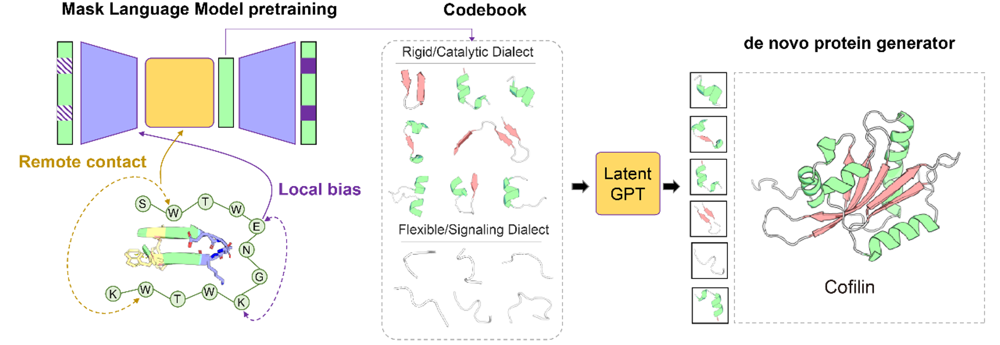
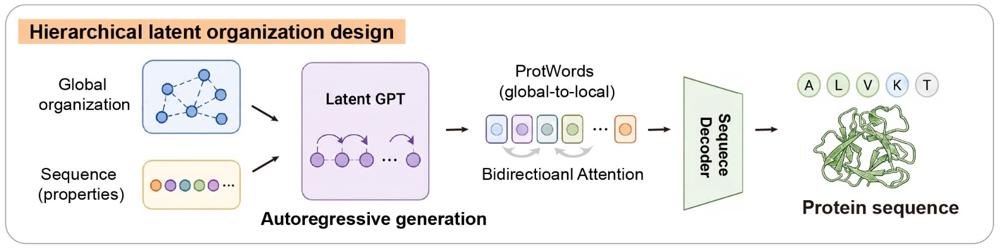

# 🧬 RELIC: Hierarchical Latent Representations for Protein Functional Discovery and Design

[](#-license--biosecurity)
[]()
[](https://doi.org/10.5281/zenodo.20461149)

Welcome to the official repository of **RELIC** (Relational Encoding of Latent Information Contexts) and its discrete vocabulary, **ProtWord**. 

## 💡 The Idea: Why RELIC & ProtWord? 

Proteins can preserve conserved functions despite extensive sequence and structural divergence. This robustness reflects the fact that protein function is governed by distributed topological constraints, which are often invisible to conventional sequence alignments or static 3D structures in the evolutionary "twilight zone." 

To capture these intermediate organizational features directly from primary sequences, we developed **RELIC**. By separating local sequence reconstruction from global contextual encoding, RELIC learns hierarchical representations that isolate structural topology and long-range relationships:

1. **Hierarchical Convolutional Bottleneck (RELIC):** We compress the sequence 4x through an encoder-decoder framework. This reduces the burden on the bottleneck to encode short-range details, biasing the deepest representations toward distributed, long-range topological relationships. 
2. **Discrete Vocabulary (ProtWords):** A VQ-VAE quantizes this continuous latent landscape into a learnable codebook of **8,192 context-dependent latent protein states**. Rather than rigid sequence motifs, ProtWords encode recurrent physicochemical environments whose final amino acid realization depends on the broader structural context.
3. **Latent Generation (Latent GPT):** An autoregressive transformer trained directly on this compressed, discrete vocabulary. It learns the combinatorial grammar of protein architecture, simultaneously constraining global organization and local sequence environments.


*Figure 1: The RELIC framework and ProtWord discretization. From hierarchical continuous modeling to discrete evolutionary protein words, and finally to a de novo protein generator.*

### 🎨 Generative Design in Latent Space
Rather than designing proteins amino-acid by amino-acid, the RELIC framework enables sequence generation at a higher conceptual level. By compressing continuous sequences into discrete "protein words," we trained a **Latent GPT** to learn the autoregressive grammar of protein topology. This allows the model to dream up entirely new architectural configurations directly in the compressed latent space, before decoding them back into physical amino acid sequences. 


*Figure 2: Generative design workflow. The Latent GPT autoregressively samples discrete protein words to design novel, functional proteins (such as pwCofilins) directly in the latent space.*
*Figure S1: Inference latency and peak memory usage. RELIC scales highly efficiently compared to standard architectures.*

## 🐁 From in silico Discovery to in vivo and in vitro Design
We demonstrate the discovery potential of this semantic axis across two major applications:
- **Functional Discovery:** RELIC prioritized previously uncharacterized proteins in the human proteome's twilight zone, leading to the discovery of **ADMAP1 (C7orf57)**. CRISPR-Cas9 knockout mice validated ADMAP1 as a crucial microtubule-associated protein required for normal sperm axonemal organization and motility.
- **Generative Design:** Autoregressive sampling in ProtWord space generated **pwCofilins**—highly divergent, synthetic actin-remodeling proteins that maintained robust, experimentally validated F-actin severing and disassembly activity despite sharing as little as ~52% sequence identity with natural homologs.

---

## 📂 Repository Structure

Due to GitHub's file size limits, massive matrices, evaluation datasets, and model weights (**6GB+**) are hosted on Zenodo. 
```
.
├── RELIC_data/            # Empty on GitHub (Download plot data from Zenodo)
├── RELIC_ckpt/            # Empty on GitHub (Download weights from Zenodo)
├── figure/                # Jupyter Notebooks for reproducing paper figures
├── images/                # Readme assets (Figure1.png, Figure2.png)
└── RELIC/
    ├── data/              # Empty on GitHub (Evaluation datasets from Zenodo)
    ├── relic/             # Core Neural Network Modules (Encoder, VQ, GPT)
    └── scripts/           # Ready-to-use inference scripts
```
---

## 🛠️ Installation & Requirements

Ensure you have Anaconda/Miniconda installed. 

## 1. Clone the repository
```
git clone https://github.com/young55775/RELIC.git
cd RELIC
```
## 2. Create conda environment
```
conda create -n relic python=3.11
conda activate relic
```
## 3. Install PyTorch (Adjust CUDA version if necessary for your hardware)
```
pip install torch torchvision torchaudio --index-url https://download.pytorch.org/whl/cu121
```
## 4. Install required dependencies
```
pip install fair-esm biopython seaborn matplotlib tqdm numpy scipy scikit-learn numba h5py pandas
```
## 5. Download Weights
### Download `checkpoints.zip` from our Zenodo repository and extract it into `RELIC_ckpt` [10.5281/zenodo.20461149](https://doi.org/10.5281/zenodo.20461149)

---

## 🚀 Quick Start / Usage

We provide several out-of-the-box scripts for inference and analysis. **Please run all commands from inside the `RELIC/` directory.**

cd RELIC

### 1. Discretize Sequence to VQ Codes (ProtWords)
Convert a natural protein sequence into its compressed, discrete "protein words" (latent tokens).
```
python scripts/seq_to_codes.py \
    --encoder_ckpt ../RELIC_ckpt/encoder_t12_150M.pth \
    --vq_ckpt ../RELIC_ckpt/vqvae_8192.pth \
    --seq "MSLLSRVRRFKVFVD"
```
### 2. Generative Design (Latent GPT)
Let the Latent GPT model dream up new protein sequences based on the 8,192-token discrete codebook. 

**Option A: Pure Unconditional Generation** (Explore the natural protein manifold)
```
python scripts/gpt_sample.py \
    --gpt_ckpt ../RELIC_ckpt/gpt_8192.pth \
    --vq_ckpt ../RELIC_ckpt/vqvae_8192.pth \
    --similarity_threshold 0.4 \
    --num_samples 100 \
    --top_k 50 --top_p 0.95 --temperature 1.0
```
**Option B: Family-Specific Generation** (e.g., *de novo* Cofilin variants)
```
python scripts/gpt_sample.py \
    --gpt_ckpt ./checkpoints/cofilin.pth \
    --vq_ckpt ./checkpoints/vqvae_8192.pth \
    --similarity_threshold 0.6 \
    --num_samples 100 \
    --top_k 50 --top_p 0.95 --temperature 1.0
```
---

## 🔍 Sequence Embedding and Remote Homology Alignment

These two scripts are used for protein sequence embedding generation and sequence-level alignment based on learned embeddings to facilitate remote homology detection.

### `genome_embedding.py`

`genome_embedding.py` generates RELIC embedding representations for all protein sequences in a genome-scale FASTA file (e.g., from UniProt). The script uses the custom Conv-UNet-Transformer architecture to extract residue-level embeddings and stores them in an HDF5 database.

**Main features:**
- Supports large genome/proteome FASTA files
- Automatically splits long sequences with overlaps
- Multi-GPU distributed inference using PyTorch DDP
- Outputs compressed HDF5 embedding database

#### Usage
```
torchrun --nproc_per_node=4 genome_embedding.py \
    -i proteome.fasta \
    -p ../RELIC_ckpt/encoder_t12_150M.pth \
    -o genome_embeddings.h5 \
    -b 16
```
#### Arguments
| Argument              | Description                                    |
| --------------------- | ---------------------------------------------- |
| `-i`, `--input_fasta` | Input FASTA file                               |
| `-p`, `--param_path`  | Model parameter file                           |
| `-o`, `--output_h5`   | Output embedding database (default: output.h5) |
| `-b`, `--batch_size`  | Batch size (default: 16)                       |

---

### `seq_align.py`

`seq_align.py` aligns a query protein sequence against the embedding database generated by `genome_embedding.py`. 

**The script performs:**
- Embedding extraction for the query sequence
- Whitening transformation of embeddings
- Approximate nearest-neighbor candidate selection
- Smith-Waterman-like local alignment on embedding similarity matrices
- Statistical Z-score normalization of alignment scores

The final results are exported as a ranked CSV table.

#### Usage
```
python seq_align.py \
    -s MTEITAAMVKELRESTGAGMMDCKNALSETQHEK \
    -p model.pt \
    -e genome_embeddings.h5 \
    -o results.csv
```
#### Arguments
| Argument             | Description                                           |
| -------------------- | ----------------------------------------------------- |
| `-s`, `--seq`        | Query protein sequence                                |
| `-p`, `--param_path` | Model parameter file                                  |
| `-e`, `--embed_path` | Embedding database generated by `genome_embedding.py` |
| `-o`, `--output_csv` | Output result CSV                                     |
| `-d`, `--device`     | Device (e.g., `cuda:0` or `cpu`)                      |
| `--force_brute`      | Disable KNN candidate filtering                       |

*(Note: Statistical normalization files (`*.npz`) are automatically cached after the first alignment run. For very large databases, KNN candidate filtering significantly accelerates search speed).*

---

## 🔬 Example Workflow

### Step 1: Build Embedding Database
Input FASTA (`example.fasta`):
```
>sp|P12345|Protein_A
MTEITAAMVKELRESTGAGMMDCKNALSETQHEK

>sp|Q54321|Protein_B
MVLSPADKTNVKAAWGKVGAHAGEYGAEALE
```
Run:
```
torchrun --nproc_per_node=2 scripts/genome_embedding.py \
    -i example.fasta \
    -p ../RELIC_ckpt/encoder_t12_150M.pth \
    -o example_embeddings.h5

Output file: `example_embeddings.h5`
```
### Step 2: Search Similar Sequences
Run:
```
python scripts/seq_align.py \
    -s MATTALQTIDTHHSGNIHDAQLDYYGKKLATASSDCKINIFEVVGDSHHNQLDSLSGHDGPVWQVGWAHPKFGVLLAS \
    -p ../RELIC_ckpt/encoder_t12_150M.pth \
    -e example_embeddings.h5 \
    -o search_results.csv
```
Output file: `search_results.csv`

#### Example Result Table
| Protein   | Z-Score | Q_Cov  | T_Cov  | Identity | N_Match | N_Mismatch | N_Gap | Len_Q | Len_T | Raw_Score |
| --------- | ------- | ------ | ------ | -------- | ------- | ---------- | ----- | ----- | ----- | --------- |
| Protein_X | 2.45    | 100.0% | 38.1%  | 98.4%    | 20      | 0          | 11    | 20    | 91    | 8.79e+04  |
| Protein_Y | 1.82    | 90.0%  | 93.2%  | 91.7%    | 18      | 0          | 65    | 20    | 82    | 2.08e+04  |

---

## 🏋️ Training Scripts (For Reference)

For complete transparency and to support reproducibility, we have included the original training scripts used to develop the RELIC and ProtWord models in the `scripts/training/` directory. 

**⚠️ Important Disclaimer Before Running:**
Please note that these scripts are provided **"as-is"** as raw, standalone Python files. They are intended primarily for reference and educational purposes rather than out-of-the-box execution. If you intend to train your own models from scratch or fine-tune them, you must make the following adjustments:

* **Hardware Configuration:** The scripts were written for our specific multi-GPU distributed training environment (PyTorch DDP). You will need to manually adjust the environment variables, CUDA device allocations, batch sizes, and learning rates to match your specific cluster or local hardware limits.
* **Data Formatting:** The training loops expect input data to be heavily pre-processed and formatted in specific ways (e.g., specific HDF5 structures, tokenized `.pt` files). You must write your own data loaders or pre-process your datasets to exactly match the expected input pipelines before the scripts will run successfully.
* **No CLI Wrapper:** Unlike our inference scripts, these training files do not have a unified Command Line Interface (CLI) and contain hardcoded paths that you must modify.

We encourage researchers to read through the training logic (especially the hierarchical bottleneck and VQ-VAE codebook mixing schedules) and adapt the core PyTorch modules to their own training pipelines.

## 📜 Citation
If you find our model, representations, or the experimental discovery datasets useful, please cite our preprint:
```
@article{guo2026relic,
  title={Hierarchical latent representations reveal protein organization for functional discovery and design},
  author={Guo, Zhengyang and Wang, Zi and Wang, Shimin and Chai, Yongping and Xu, Kaiming and Li, Ming and Li, Wei and Ou, Guangshuo},
  journal={bioRxiv},
  year={2026},
  doi={Pending}
}
```
## ⚠️ License & Commercial Use
* **Experimental Data:** Released under **CC BY 4.0** (See `RELIC_data/LICENSE`).
* **Model Weights & Codebooks:** Governed by the **RELIC Open RAIL++-M License** (Strict biosecurity use restrictions apply. See `RELIC_ckpt/LICENSE`).
* **Source Code:** Released under the **RELIC Academic and Non-Commercial Research License** (See `LICENSE`). 

**Patent Notice:** The core methods and architectures implemented in RELIC/ProtWord are protected by pending patent applications. The source code is freely available for **academic and non-commercial research only**. 

💼 **For Commercial Licensing:** If you represent a pharmaceutical company, biotech startup, or any for-profit entity wishing to use RELIC/ProtWord for commercial protein design or target discovery, please contact `guozy23@mails.tsinghua.edu.cn` and `guangshuoou@tsinghua.edu.cn` to inquire about commercial licensing.
